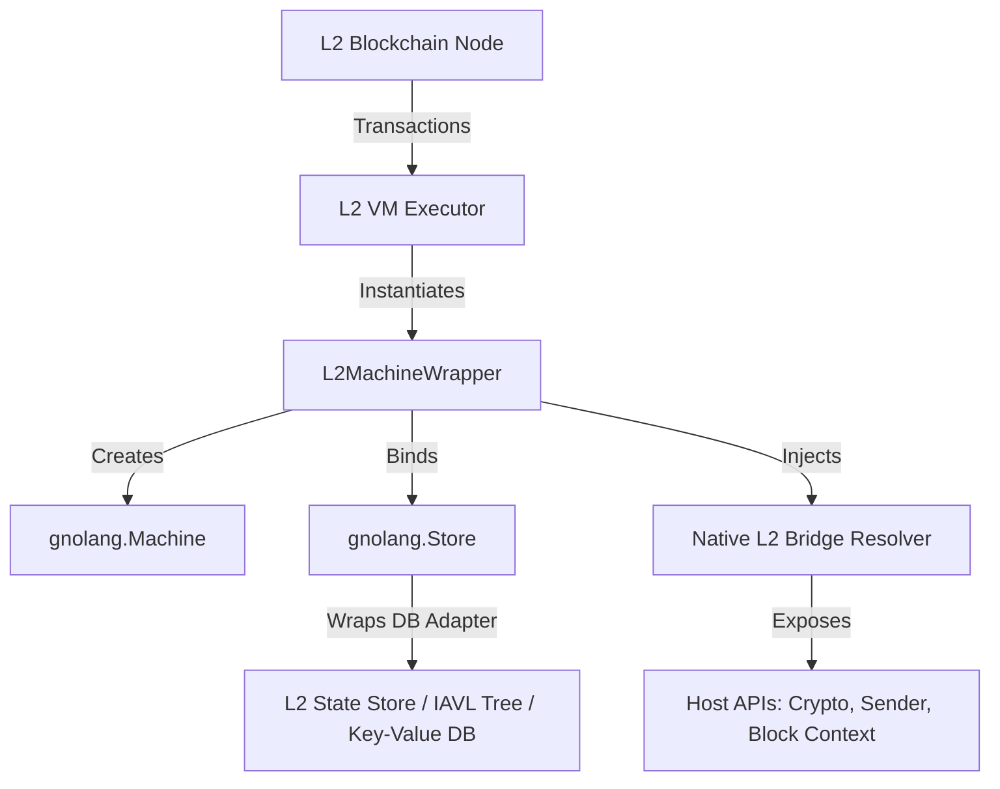

# Specification: Porting GnoVM as an L2 Blockchain Smart Contract VM

This document provides a detailed engineering specification for porting and adapting the GnoVM package (`/pkg/gnovm` in the original project) into a standalone Layer 2 (L2) blockchain project. It serves as a blueprint for coding agents to replicate the GnoVM integration patterns, transaction lifecycles, native host bridges, gas tracking, and state persistence models.

---

## 1. Architectural Overview

When using GnoVM as a smart contract VM for a Layer 2 blockchain, the VM operates as a **sandboxed, deterministic transition function** for transaction execution. The execution environment consists of:



### Key Differences from the Agentic Implementation
1. **No External I/O**: The GnoVM must run completely deterministically. Any interaction with the outside world (like tools or LLM calls) is prohibited. Instead, the VM interacts solely with the L2 state and predefined host bridges.
2. **Transaction Isolation**: Each transaction runs in a clean, sandboxed state. Uncommitted changes must be discardable if a transaction reverts.
3. **State Root Commitment**: Instead of a simple Postgres session table, the underlying database must integrate with the L2 block state root (typically via a Merkle Patricia Trie or an IAVL tree) to provide fraud/validity proofs.
4. **Gas Metering**: Every operation must consume gas to prevent denial-of-service (DoS) attacks and infinite loops.

---

## 2. L2 State Storage Architecture

GnoVM tracks all contract variables, structures, and mappings in a flat key-value namespace managed by the `gnolang.Store`. For an L2 blockchain, this storage layer must support **consistency, state rollbacks, and authenticated state roots**.

### Approach A: Merkleized State Tree (Recommended for ZK/Optimistic Rollups)
Instead of a standard database wrapper, the L2 database adapter wraps a Merkle tree structure (like an IAVL tree).
- **Key-Value Mapping**: Gno VM keys map to paths in the Merkle tree.
- **Root Calculation**: At the end of each block, the state tree commits changes, producing a cryptographic `StateRoot` hash.
- **Proof Generation**: The L2 node can generate cryptographic membership/non-membership proofs for any GnoVM state variable at a specific block height.

### Approach B: Rollup Snapshots (Freeze/Thaw Pattern)
For simple state rollups, the VM state is snapshot-based:
- **State Serialization**: The entire memory store is serialized into a byte slice using Tendermint's `amino` package.
- **Diff Tracking**: The L2 tracks the diff of the key-value changes made during block execution and pushes these diffs as transaction data to Layer 1.

---

## 3. Storage DB Adapter Interface

GnoVM relies on Tendermint's `db.DB` interface to interact with the underlying database. The porting agent must implement this interface to bridge GnoVM with the L2's persistent storage (e.g., BadgerDB, RocksDB, or a custom state trie).

### Core DB Interface (`github.com/gnolang/gno/tm2/pkg/db`)
```go
type DB interface {
    Get(key []byte) ([]byte, error)
    Has(key []byte) (bool, error)
    Set(key, value []byte) error
    SetSync(key, value []byte) error
    Delete(key []byte) error
    DeleteSync(key []byte) error
    Close() error
    NewBatch() Batch
    Iterator(start, end []byte) (Iterator, error)
    ReverseIterator(start, end []byte) (Iterator, error)
}
```

> [!IMPORTANT]
> The database implementation must handle sub-transactions (saving checkpoints and rolling back state changes on execution failures).

---

## 4. Smart Contract Lifecycle on the L2

### Contract Deployment
1. The developer submits a deployment transaction containing a bundle of `.gno` files and a target path (e.g., `gno.land/r/l2/dex`).
2. The L2 node reads the files, constructs a `std.MemPackage`, and loads it into the `gnolang.Machine`.
3. The VM compiles and runs the package's initialization functions.
4. The updated VM state (containing the new code and initial variables) is persisted to the state database.

### Transaction execution loop
1. **Instantiate**: Retrieve the target contract state from the database.
2. **Apply Context**: Pass execution context (Sender, Value, GasLimit, BlockHeight) into the VM.
3. **Execute**: Evaluate the target package function.
4. **Gas Check**: Ensure gas consumption does not exceed the limit.
5. **Commit/Revert**: 
   - If execution succeeds: Apply database batch updates and calculate the new state root.
   - If execution fails: Rollback the state to the pre-transaction checkpoint.

---

## 5. Reference Implementation

Here is the reference code for the key modules needed to port GnoVM to an L2 blockchain project.

### 5.1. The L2 Machine Wrapper (`pkg/l2vm/machine.go`)

```go
package l2vm

import (
	"context"
	"fmt"
	"strings"

	"github.com/gnolang/gno/gnovm/pkg/gnolang"
	"github.com/gnolang/gno/tm2/pkg/amino"
	"github.com/gnolang/gno/tm2/pkg/db"
	"github.com/gnolang/gno/tm2/pkg/std"
	"github.com/gnolang/gno/tm2/pkg/store/dbadapter"
)

// TransactionContext defines the execution metadata injected for each tx.
type TransactionContext struct {
	Sender    string
	Value     uint64
	Height    int64
	Timestamp int64
	GasLimit  int64
}

// L2MachineWrapper handles initialization, execution, and state snapshots.
type L2MachineWrapper struct {
	Machine *gnolang.Machine
	Store   gnolang.Store
	DB      db.DB
	PkgPath string
}

type dbEntry struct {
	K []byte
	V []byte
}

// NewL2MachineWrapper boots up a GnoVM instance bound to an L2 database.
func NewL2MachineWrapper(pkgPath string, stateStore db.DB, source map[string]string) (*L2MachineWrapper, error) {
	if pkgPath == "" {
		return nil, fmt.Errorf("package path is required")
	}

	baseStore := dbadapter.Store{DB: stateStore}
	alloc := gnolang.NewAllocator(0)
	store := gnolang.NewStore(alloc, baseStore, baseStore)

	// Set Native Resolver for injecting Host L2 APIs
	store.SetNativeResolver(L2NativeResolver)

	m := gnolang.NewMachine(pkgPath, store)

	// Deploy package if initial source code is provided
	if len(source) > 0 {
		parts := strings.Split(pkgPath, "/")
		pkgName := parts[len(parts)-1]

		mpkg := &std.MemPackage{
			Name:  pkgName,
			Path:  pkgPath,
			Type:  gnolang.MPUserProd,
			Files: make([]*std.MemFile, 0, len(source)),
		}
		for name, body := range source {
			mpkg.Files = append(mpkg.Files, &std.MemFile{
				Name: name,
				Body: body,
			})
		}
		_, pv := m.RunMemPackage(mpkg, true)
		m.SetActivePackage(pv)
	}

	return &L2MachineWrapper{
		Machine: m,
		Store:   m.Store,
		DB:      stateStore,
		PkgPath: pkgPath,
	}, nil
}

// Eval runs a Gno expression inside the VM under a specific gas limit.
func (w *L2MachineWrapper) Eval(expr string, txCtx *TransactionContext) ([]gnolang.TypedValue, error) {
	// Set execution context
	w.Machine.Context = txCtx

	// Setup Gas Metering
	gasMeter := gnolang.NewGasMeter(txCtx.GasLimit)
	w.Machine.SetGasMeter(gasMeter)

	parsed := w.Machine.MustParseExpr(expr)
	res := w.Machine.Eval(parsed)

	if gasMeter.IsOutOfGas() {
		return nil, fmt.Errorf("out of gas: consumed %d", gasMeter.GasConsumed())
	}

	return res, nil
}

// ExportState extracts the underlying KV database state as a byte slice.
func (w *L2MachineWrapper) ExportState() ([]byte, error) {
	it, err := w.DB.Iterator(nil, nil)
	if err != nil {
		return nil, err
	}
	defer it.Close()

	var entries []dbEntry
	for ; it.Valid(); it.Next() {
		entries = append(entries, dbEntry{K: it.Key(), V: it.Value()})
	}
	return amino.Marshal(entries)
}

// RestoreState populates the KV database state from a serialized snapshot.
func (w *L2MachineWrapper) RestoreState(b []byte) error {
	var entries []dbEntry
	if err := amino.Unmarshal(b, &entries); err != nil {
		return err
	}

	for _, e := range entries {
		if err := w.DB.Set(e.K, e.V); err != nil {
			return err
		}
	}
	return nil
}
```

### 5.2. Custom Transactional Database Adapter (`pkg/l2vm/db.go`)

This adapter wraps a standard Key-Value store and provides transactional checkpoints to handle tx rollbacks.

```go
package l2vm

import (
	"fmt"
	"sync"

	"github.com/gnolang/gno/tm2/pkg/db"
)

// TransactionalDB wraps any db.DB to support atomic transaction rollbacks.
type TransactionalDB struct {
	mu        sync.RWMutex
	underlying db.DB
	pending   map[string][]byte
	deleted   map[string]bool
}

func NewTransactionalDB(underlying db.DB) *TransactionalDB {
	return &TransactionalDB{
		underlying: underlying,
		pending:    make(map[string][]byte),
		deleted:    make(map[string]bool),
	}
}

func (t *TransactionalDB) Get(key []byte) ([]byte, error) {
	t.mu.RLock()
	defer t.mu.RUnlock()

	kStr := string(key)
	if t.deleted[kStr] {
		return nil, nil
	}
	if val, ok := t.pending[kStr]; ok {
		return val, nil
	}
	return t.underlying.Get(key)
}

func (t *TransactionalDB) Has(key []byte) (bool, error) {
	t.mu.RLock()
	defer t.mu.RUnlock()

	kStr := string(key)
	if t.deleted[kStr] {
		return false, nil
	}
	if _, ok := t.pending[kStr]; ok {
		return true, nil
	}
	return t.underlying.Has(key)
}

func (t *TransactionalDB) Set(key, value []byte) error {
	t.mu.Lock()
	defer t.mu.Unlock()

	kStr := string(key)
	delete(t.deleted, kStr)
	t.pending[kStr] = value
	return nil
}

func (t *TransactionalDB) SetSync(key, value []byte) error {
	return t.Set(key, value)
}

func (t *TransactionalDB) Delete(key []byte) error {
	t.mu.Lock()
	defer t.mu.Unlock()

	kStr := string(key)
	delete(t.pending, kStr)
	t.deleted[kStr] = true
	return nil
}

func (t *TransactionalDB) DeleteSync(key []byte) error {
	return t.Delete(key)
}

// Commit flushes pending writes to the underlying persistent storage.
func (t *TransactionalDB) Commit() error {
	t.mu.Lock()
	defer t.mu.Unlock()

	batch := t.underlying.NewBatch()
	for k, v := range t.pending {
		batch.Set([]byte(k), v)
	}
	for k := range t.deleted {
		batch.Delete([]byte(k))
	}
	
	err := batch.WriteSync()
	if err == nil {
		t.pending = make(map[string][]byte)
		t.deleted = make(map[string]bool)
	}
	return err
}

// Discard clears pending session modifications (rollback).
func (t *TransactionalDB) Discard() {
	t.mu.Lock()
	defer t.mu.Unlock()
	t.pending = make(map[string][]byte)
	t.deleted = make(map[string]bool)
}

func (t *TransactionalDB) Close() error {
	return t.underlying.Close()
}

func (t *TransactionalDB) NewBatch() db.Batch {
	return t.underlying.NewBatch()
}

func (t *TransactionalDB) Iterator(start, end []byte) (db.Iterator, error) {
	return t.underlying.Iterator(start, end)
}

func (t *TransactionalDB) ReverseIterator(start, end []byte) (db.Iterator, error) {
	return t.underlying.ReverseIterator(start, end)
}
```

### 5.3. Native L2 Host Bridge (`pkg/l2vm/native.go`)

Exposes host information (e.g. transaction sender) directly into GnoVM.

```go
package l2vm

import (
	"reflect"

	"github.com/gnolang/gno/gnovm/pkg/gnolang"
)

// L2NativeResolver routes VM package imports for gno.land/p/l2
func L2NativeResolver(pkgPath string, name gnolang.Name) func(m *gnolang.Machine) {
	if pkgPath == "gno.land/p/l2" {
		switch string(name) {
		case "GetSender":
			return func(m *gnolang.Machine) {
				ctx, ok := m.Context.(*TransactionContext)
				if !ok {
					m.PushValue(gnolang.Go2GnoValue(m.Alloc, m.Store, reflect.ValueOf("")))
					return
				}
				m.PushValue(gnolang.Go2GnoValue(m.Alloc, m.Store, reflect.ValueOf(ctx.Sender)))
			}
		case "GetHeight":
			return func(m *gnolang.Machine) {
				ctx, ok := m.Context.(*TransactionContext)
				if !ok {
					m.PushValue(gnolang.Go2GnoValue(m.Alloc, m.Store, reflect.ValueOf(int64(0))))
					return
				}
				m.PushValue(gnolang.Go2GnoValue(m.Alloc, m.Store, reflect.ValueOf(ctx.Height)))
			}
		}
	}
	return nil
}
```

And corresponding Gno contract usage:
```go
package mycontract

import (
	"gno.land/p/l2"
)

func CallMe() string {
	sender := l2.GetSender()
	height := l2.GetHeight()
	return "Called by " + sender + " at block height " + string(height)
}
```

---

## 6. Actionable Implementation Checklist for the Coding Agent

When setting up the new repository, follow this step-by-step checklist:

- [ ] **Step 1: Go Module Setup**
  Add the Gno dependency to the new project's `go.mod`:
  ```bash
  go get github.com/gnolang/gno@v0.0.0-20260319132221-e6da9024ac5c
  ```
- [ ] **Step 2: Add Database Adapters**
  Copy and customize `pkg/l2vm/db.go` to provide transaction boundaries (`Commit` / `Discard`). Ensure that it integrates with the project's chosen persistent store (e.g. BadgerDB, RocksDB, or Postgres).
- [ ] **Step 3: Port and Refactor the Machine Wrapper**
  Write the execution engine (`pkg/l2vm/machine.go`) incorporating gas limits and gas checks.
- [ ] **Step 4: Establish the Host Native Bridge**
  Define and register the native function resolver to make cryptographic helpers and transaction context accessible in contracts.
- [ ] **Step 5: Write the Transaction Execution Engine**
  Implement the high-level transactional execution interface:
  ```go
  func ExecuteTx(stateDB db.DB, pkgPath, funcExpr string, txCtx *TransactionContext) (any, error)
  ```
- [ ] **Step 6: Write Determinism Tests**
  Construct a test suite verifying that executions with identical inputs on different machines yield identical DB state hashes, and that gas counts match exactly.
