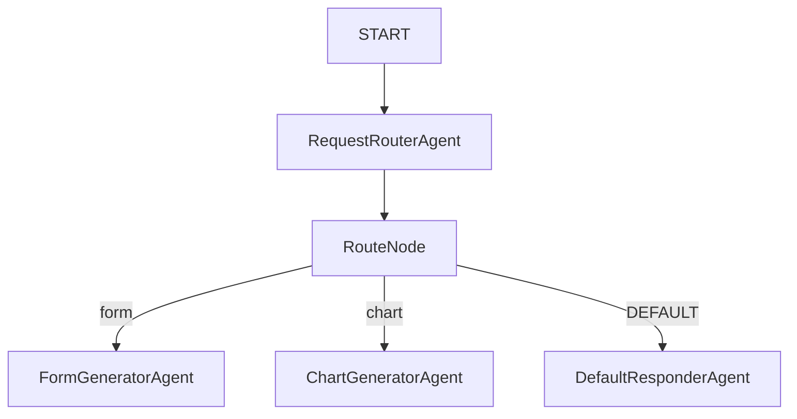

# A2UI Workflow Example

This example demonstrates how to build a dynamic user interface flow with **Agentic UI (A2UI)** components using an **ADK 2.0 DAG workflow** (`type: workflow`) configuration.

A2UI is an open protocol designed by Google that allows AI agents to output structured JSON representations of UI components (such as forms, charts, tables, and cards) instead of plain text. Frontend applications can then render these components natively to provide a rich, interactive experience.

## Workflow DAG Structure

The workflow consists of five nodes connected in a Directed Acyclic Graph (DAG):



### Nodes

1. **`START`**: The entry point of the workflow which receives the initial user query.
2. **`RequestRouterAgent`**: An LLM agent configured to classify the user's intent into exactly one word: `form`, `chart`, or `default`.
3. **`RouteNode`**: A custom `route_generator` agent that translates the classifier's text output into workflow route events (`event.Routes`).
4. **`FormGeneratorAgent`**: An LLM agent instructed to produce an interactive A2UI Form component payload (`a2ui.Form`) to capture customer info.
5. **`ChartGeneratorAgent`**: An LLM agent instructed to produce a rich data visualization using the A2UI Chart payload (`a2ui.Chart`).
6. **`DefaultResponderAgent`**: An LLM agent that handles general conversation and prompts the user on what inputs to write to trigger the UI elements.

## Getting Started

### 1. Build the Main Binary

From the repository root, build the main application executable:

```bash
go build -o agentic .
```

### 2. Configure environment

Ensure your Google Gemini API key is set in the environment:

```bash
export GOOGLE_API_KEY="your-gemini-api-key"
```

### 3. Run in Web UI Mode

The built-in ADK Web UI natively renders A2UI components. Run the agentic launcher with the `-webui` flag:

```bash
./agentic -webui examples/a2ui-workflow/config.yaml
```

Once running, navigate to `http://localhost:8080` in your web browser. You can trigger different UI widgets by typing:
- *"I want to fill out the plant selection form"* to view and interact with the **A2UI Form**.
- *"Show me the plant sales chart"* to render the **A2UI Line Chart**.
- *"Hi there!"* to see the text response from the general/default responder.

### 4. Run in Console Mode

For testing or debugging in the CLI, you can launch the console interface:

```bash
./agentic -console examples/a2ui-workflow/config.yaml
```
