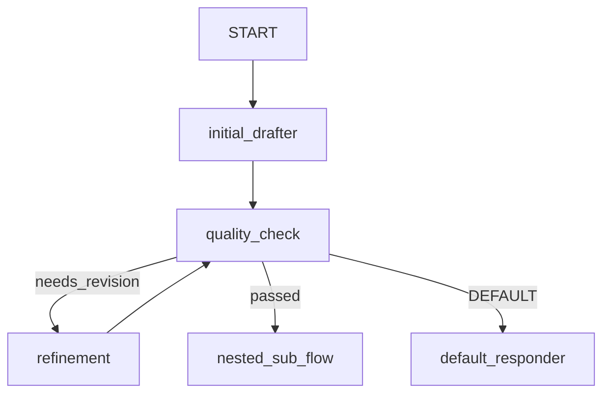

# ADK 2.0 Graph Workflow Example

This example demonstrates how to build cyclic, self-refining graph workflows using **ADK 2.0 Graph Workflows** (`type: workflow`) in the `agentic` framework.

## Features Illustrated

- **Cyclic Feedback Loops**: Dynamic routing loop (`quality_check` <-> `refinement`) until evaluation criteria are satisfied (`passed`).
- **State Payload Key Mappings**: `input_map` and `output_map` for explicit context variable passing.
- **Nested Sub-Workflows**: Invoking sub-workflow agents (`sub_workflow: SummarySubWorkflow`) as nodes inside parent graphs.
- **Node-Level Retries & Fallbacks**: `retries: 2` and `fallback_node: default_responder` on graph nodes.

## Graph Visual Structure



## Running the Example

### Export Graph Visualization
```bash
./agentic -export-graph examples/graph-workflow/config.yaml
```

### Run Console Interface
```bash
./agentic examples/graph-workflow/config.yaml console
```
